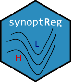
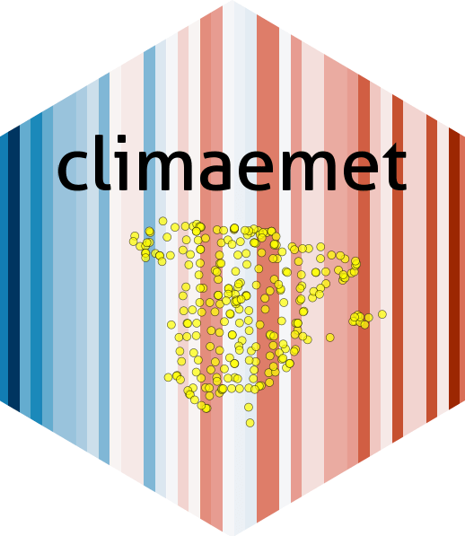

<h5 class="card-title"><a href="https://lemuscanovas.github.io/synoptreg/" class="text-decoration-none">synoptReg</a></h5>

R package for computing synoptic climate classifications and spatial regionalization of environmental variables using gridded atmospheric data.

<h5 class="card-title"><a href="https://ropenspain.github.io/climaemet/" class="text-decoration-none">climaemet</a></h5>

R package (rOpenSpain) to download and visualize climate data from AEMET (Spanish Meteorological Agency) API.

<h5 class="card-title"><a href="https://www.ari.ad/en/research/" class="text-decoration-none">Pyrenees Climate</a></h5>

High-resolution climate projections for the Pyrenees combining dynamical downscaling with observational data to characterize future climate scenarios.

<h5 class="card-title"><a href="https://doi.org/10.1088/1748-9326/ac1c88" class="text-decoration-none">Compound Events</a></h5>

Research on dry-hot compound events in the Pyrenees under current and future climate conditions, assessing changes in frequency, intensity, and duration.

